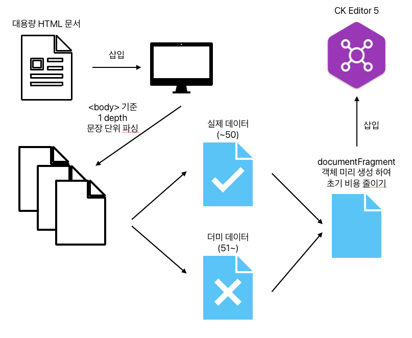
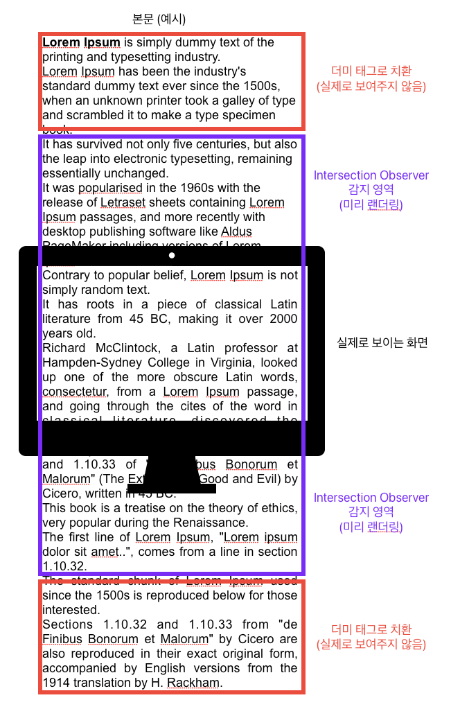
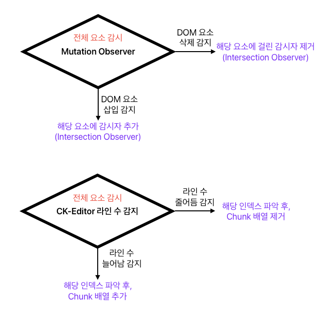

# editor.osb.im

## 프로젝트 목적 및 목표

목적은 대용량 HTML 파일을 보다 효율적으로 처리하고, 사용자가 원활하게 편집할 수 있도록 하는 것입니다.
<br />
이를 통해 성능을 개선하고, 사용자 경험을 향상시키는 것을 목표로 합니다.

## 프로젝트 소개
이 프로젝트는 다음 두 옵저버를 활용하여 대용량 HTML 파일의 사용 성능을 개선하였습니다.
- IntersectionObserver
  - [영어 MDN 문서](https://developer.mozilla.org/en-US/docs/Web/API/Intersection_Observer_API)
  - [한국어 MDN 문서](https://developer.mozilla.org/ko/docs/Web/API/Intersection_Observer_API)
- MutationObserver
  - [영어 MDN 문서](https://developer.mozilla.org/en-US/docs/Web/API/MutationObserver)
  - [한국어 MDN 문서](https://developer.mozilla.org/ko/docs/Web/API/MutationObserver)

### 작동 방식
작동 방식은 아래와 같습니다.
1. 사용자가 대용량 HTML 파일을 업로드합니다.
2. Dom Parser를 활용하여 HTML 파일을 파싱하여 문자열 배열로 변환합니다.
3. 최초 50개 아이템을 화면에 렌더링합니다.
4. 나머지 아이템은 `dummy` 아이템으로 대체하여 렌더링합니다.
5. 사용자가 스크롤을 내릴 때마다 `IntersectionObserver`를 활용하여 화면에 보이는 아이템을 렌더링합니다.
   - `Chunk` ↔ `Dummy` 동적으로 교체합니다.
6. `MutationObserver`를 활용하여 아이템이 에디터 영역에 추가될 때마다 `IntersectionObserver`를 적용합니다.

### 사진으로 보는 작동 방식
사진으로 보면 다음과 같습니다.

#### 초기 데이터 삽입

#### 편집 중 데이터 제어

#### 데이터 추가 / 삭제 시 동작


## 프로젝트 환경
- Vue 3
- Composition API
- CKEditor 5
- npm
- Node.js 18.20.0

## 디렉토리 구조
일관된 구조를 위해 FSD(기능 분할 설계) 아키텍처 구성을 따릅니다.
```plaintext
/src/pages/ckeditor/virtual-scroll.vue                  // 성능 개선을 위한 Vue 템플릿이 위치한 파일
/src/features/ckeditor/model/virtual-scroll/index.js    // 성능 개선을 위한 스크립트가 위치한 파일

/src/pages/ckeditor/default.vue                         // 비교를 위해 준비된 기본 Vue 템플릿
/src/features/ckeditor/model/default/index.js           // 비교를 위해 준비된 기본 스크립트
```

## 테스트 방법
1. [테스트 페이지](https://editor.osb.im/ckeditor/virtual-scroll)로 이동
2. `File Upload` 버튼을 클릭하여 대용량 HTML 파일을 업로드
3. [비교 페이지](https://editor.osb.im/ckeditor/default)와 비교하여 성능 차이 확인

## 설치 및 실행

### 배포
이 프로젝트의 배포판은 아래 주소에서 확인하실 수 있습니다.
- https://editor.osb.im/ckeditor/virtual-scroll

아래는 비교를 위해 준비된 기본 에디터의 주소입니다.
- https://editor.osb.im/ckeditor/default

### 로컬
1. 저장소 클론
```bash
git clone https://github.com/your-username/editor.osb.im.git
cd editor.osb.im
```

2. 의존성 설치
```bash
npm install
```

3. 로컬 서버 실행
```bash
npm run dev
```

4. 브라우저에서 확인
```plaintext
http://localhost:8080/ckeditor/virtual-scroll
```
